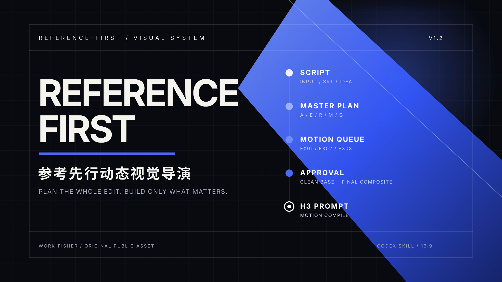
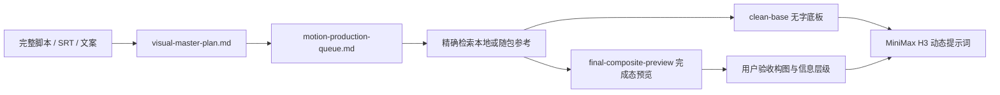
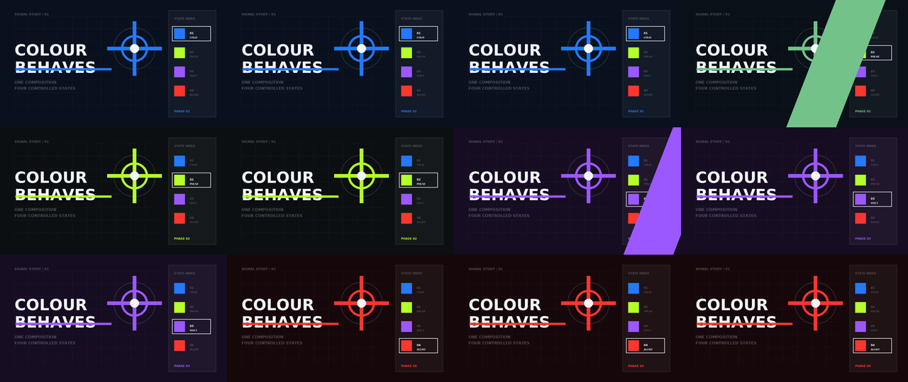
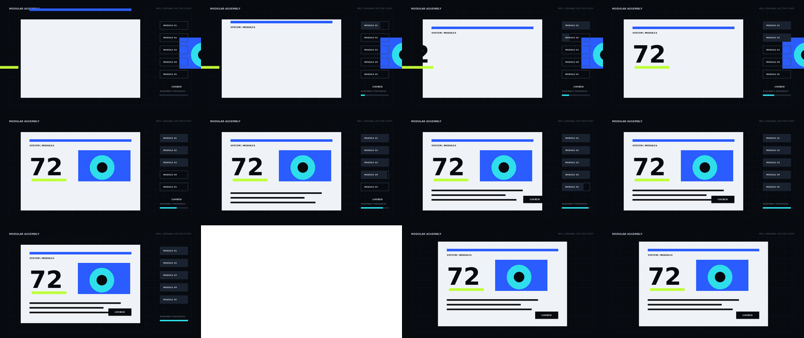
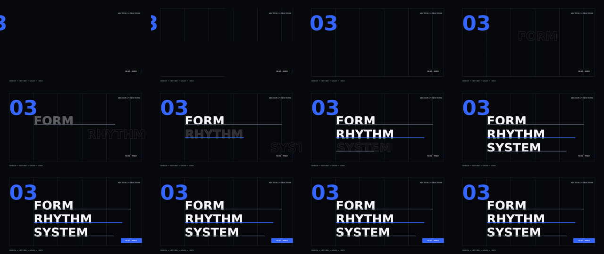
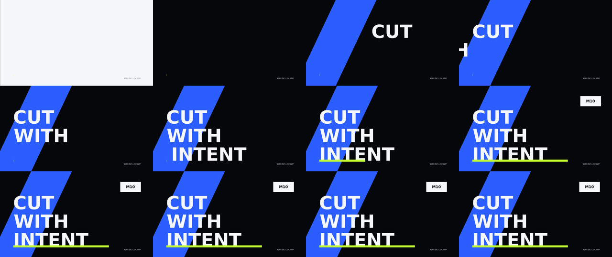

# Reference-first Motion Director


> 参考先行的整片视觉导演工作流：先锁定全片职责与动效清单，再检索参考、验收关键帧并编译 MiniMax H3 提示词。



它不是“每句话都生成一张人物图”的提示词模板。它先判断哪里应该使用人物、真实证据、录屏、现有素材、动态包装或生成镜头，再只制作真正需要独立设计的动效。

## 核心流程



- **整片优先**：先保存完整视觉总表，避免被上一张图或最近上下文带偏。
- **清单优先**：从总表派生动效制作清单，先让用户确认真正需要制作的内容。
- **证据优先**：真实页面、作品、录屏和现有素材优先于抽象包装。
- **参考可追溯**：分别绑定色彩/材质、构图/字体和运动/镜头参考，不复制品牌、原文案或完整布局。
- **完成态验收**：文字或 UI 参与语义时，同时准备完成态预览和严格对齐的无字底板。
- **动态再编译**：用户通过静帧后，再选择 I2VA、L2VA、FL2VA、Ref2VA 或 T2VA。

## 安装

推荐直接在 Codex 中输入：

```text
使用 $skill-installer 安装这个 Skill：
https://github.com/Work-Fisher/reference-first-motion-director/tree/main/reference-first-motion-director
```

也可以克隆仓库后，把 [`reference-first-motion-director`](reference-first-motion-director/) 目录复制到：

```text
$HOME/.agents/skills/reference-first-motion-director
```

安装后重新打开 Codex 任务，调用：

```text
$reference-first-motion-director
```

示例请求：

```text
使用 $reference-first-motion-director 分析这份完整口播脚本。
先保存整片视觉总表，再把需要单独制作的动效清单给我确认；
确认后从参考库找精确案例，先生成关键静帧，再输出 H3 提示词。
```

## 开箱可用的 starter library

不配置本机素材路径也能检索 4 支原创轻量案例和对应的 12 帧联络表。四支案例全部由仓库内可复现的 Python 源码以纯矢量图元逐帧渲染：

| 模式 | 预览 | 学习机制 | 视频 |
|---|---|---|---|
| M02 |  | 固定构图、单变量换色、状态索引 | [MP4](reference-first-motion-director/assets/starter-library/clips/signal-palette-switch.mp4) |
| M03 |  | 矢量模块依次进入、锁定、完成态 | [MP4](reference-first-motion-director/assets/starter-library/clips/modular-assembly-sequence.mp4) |
| M05 |  | 导线、描边显影、实字收束 | [MP4](reference-first-motion-director/assets/starter-library/clips/editorial-section-stack.mp4) |
| M10 |  | 方向对撞、斜切、编号钉合 | [MP4](reference-first-motion-director/assets/starter-library/clips/kinetic-title-lockup.mp4) |

这些案例用于学习信息关系、注意力顺序、色彩行为和运动规律，不是要求复制演示文案或完整布局。

正常检索和预览不需要重渲染；只有复现这些公开资产时才需要 Pillow 与 FFmpeg。

## 参考库命令

从技能目录运行：

```powershell
python -X utf8 scripts/reference_library.py status
python -X utf8 scripts/reference_library.py search --query "章节 标题"
python -X utf8 scripts/reference_library.py preview --asset-id cbb79775b708 --frames 12
```

上面三条命令无需配置即可使用随包库。需要接入自己的主知识库和增量素材库时：

```powershell
python -X utf8 scripts/reference_library.py configure `
  --reference-library "<reference-library>" `
  --primary-learning-root "<learning-root>"
```

个人视频需要生成新联络表时，系统还需可调用 `ffmpeg` 和 `ffprobe`。个人路径写入用户目录下的本机配置，不进入 SKILL 或仓库。

## 输出文件

| 文件 | 作用 |
|---|---|
| `visual-master-plan.md` | 全片唯一视觉真源，记录时间、职责、证据、表现形态、制作层和状态 |
| `motion-production-queue.md` | 从总表派生的动效制作视图，每个 `FXxx` 回链总表 |
| `clean-base` | 无文字、无 UI 的生成模型输入底板 |
| `final-composite-preview` | 带后期文字/UI的完成态审批图，用来验收构图与语义 |
| H3 prompt | 标明原视频覆盖时间，并根据已批准底板编译的动态提示词 |

## 边界

- 仓库不包含个人素材库、本机绝对路径、第三方网站下载素材、原始参考 GIF、字幕或逐秒拆帧。
- 新参考只在用户有权持有时进入个人库；保存参考不代表获得再分发权。
- SKILL 负责整片规划、参考检索、关键静帧流程和提示词编译，不声称自动生成最终视频。
- 随包 starter library 的逐项来源与排除边界记录在 [`manifest.json`](reference-first-motion-director/assets/starter-library/manifest.json)，完整画面可由 [`render_original_starter_library.py`](reference-first-motion-director/assets/starter-library/source/render_original_starter_library.py) 重新生成。仓库全部公开视觉资产另见 [`ASSET_PROVENANCE.md`](ASSET_PROVENANCE.md)。

## 验证

```powershell
python -m unittest discover -s reference-first-motion-director/scripts/tests -p "test_*.py" -v
python reference-first-motion-director/scripts/reference_library.py status
```

## License

[MIT](LICENSE)
